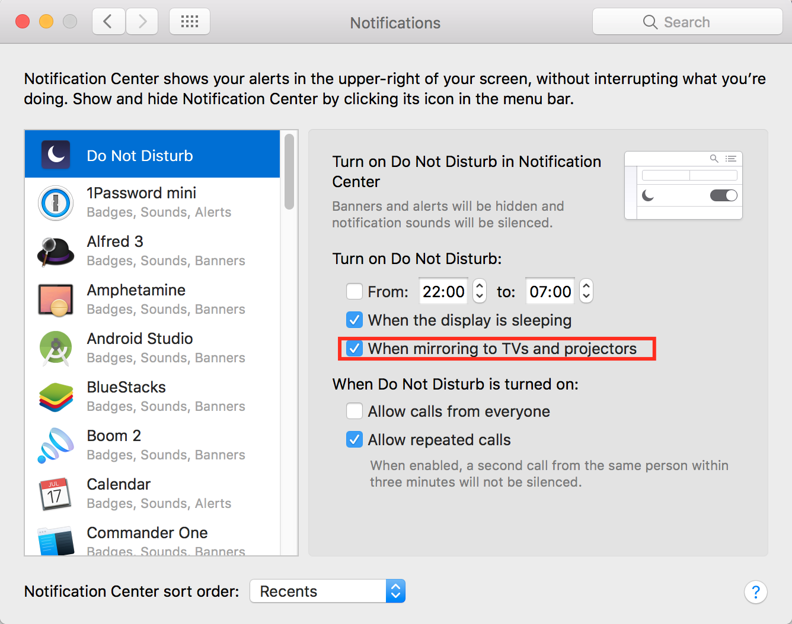

# sf-dev-tutorials
Repository containing a collection of useful tutorials that were requested in Org62

* [Automatic local iPhone backup](#automatic-local-iphone-backup)
* [Chrome Notifications](#chrome-notifications)

---

### Automatic local iPhone backup

If your iPhone does not have the possibility to make backups to iCloud automatically (for example because your company doesn't trust Apples iCloud), you can still do incremental full-backups via iTunes. However we want to go further and make these backups happen automatically when the iPhone is connected to the Mac.

1. Connect the iPhone via USB to the Mac
2. Open iTunes and setup the initial settings for a local backup
**Encrypted backups are strongly recommended, [as only these will contain ALL data](https://support.apple.com/en-us/HT205220)**
3. Download the [script file](scripts/triggeriphonebackup.applescript)
4. Open the script in the standard "Script Editor.app" and export it as an application (e.g. triggeriphonebackup.app)
5. Choose one of the following methods to grant the script the needed permissions to click on UI elements
    * Open macOS System Preferences -> Security & Privacy -> Privacy -> Accessibility. Add the exported app file to the list and enable the checkmark.
**OR**
    * Run the exported app file and follow the instructions in the pop-up.
6. Download and install [ControlPlane](https://www.controlplaneapp.com/) for some automation.
7. Create a new Context in ControlPlane, call it "iPhone connected"
8. Check if "Attached USB Device" is enabled under "Evidence Sources"
9. Create a new "Attached USB Device" Rule:
    * Using the presence of "iPhone"
    * Switch to the context "iPhone connected"
    * Confidence: 100%
10. Finally, create a new action that will open "triggeriphonebackup.app" on arrival of the "iPhone connected" context.
11. Enable the checkmark for the new action.
12. Unplug and plug in the iPhone to test the automation.

---

#### Chrome Notifications

If you're using a lot of web applications (like GMail, GCalendar, etc.) which are sending notifications, you might find it annoying that these notifications can't be disabled/enabled quickly, for instance when you are presenting a keynote and GMail notifications are constantly popping up. In macOS we don't want each application to manage its own notification system. Instead, we can force Chrome to use the native notification system of macOS, so we can control it globally.

* Type "chrome://flags" in the address bar of Google Chrome
* Look for **#enable-native-notifications** and enable that setting

* Restart Google Chrome
* Customize your settings in macOS System Preferences -> Notifications -> Do Not Disturb

---
